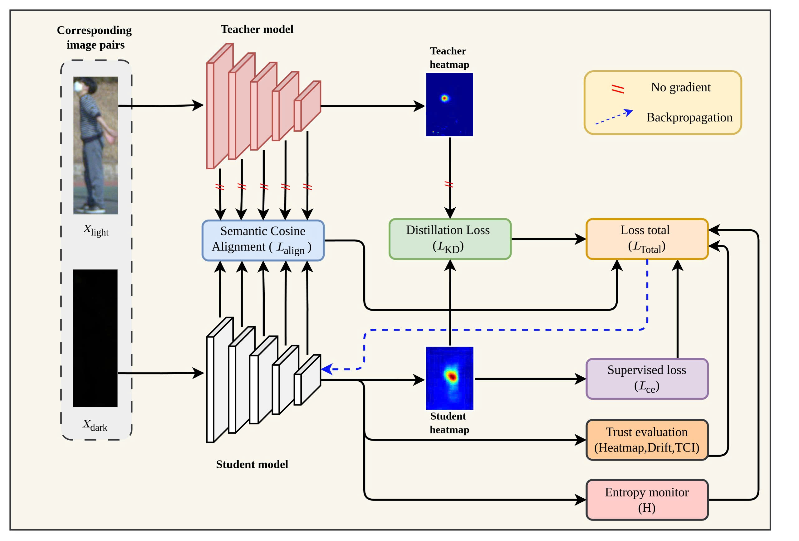

# Interpretable Knowledge Transfer for Low-Light Pose Estimation under Illumination Degradation

This repository contains the official implementation of **TrustPose**, an interpretable knowledge distillation framework designed to improve low-light pose estimation by enforcing semantic feature alignment and explicitly modeling uncertainty.

## Table of Contents
1. [Abstract](#abstract)
2. [Installation](#installation)
3. [Usage](#usage)
4. [Datasets](#datasets)
5. [Results](#results)
6. [Citation](#citation)
7. [License](#license)
8. [Contact](#contact)

## Abstract
Human pose estimation (HPE) in low-light conditions poses significant challenges due to severe signal degradation and increased predictive uncertainty. This paper proposes TrustPose, an interpretable knowledge distillation framework designed to improve low-light pose estimation by enforcing semantic feature alignment and explicitly modeling uncertainty. TrustPose integrates three components: a Teacher Dropout Protocol (TDP) that periodically withholds teacher supervision to encourage student robustness; a Semantic Cosine Alignment Module (SCAM) to align intermediate representations between teacher and student networks; and an Entropy Confidence Monitor (ECM) to calibrate predictive uncertainty during training. Experimental results demonstrate consistent improvements over strong baselines across low-light test subsets and cross-domain generalization scenarios without requiring paired well-lit images. These results indicate that TrustPose provides a principled and effective strategy for interpretable, trust-aware knowledge transfer in degraded signal environments typical of low-light vision tasks.

## Installation
### Prerequisites
- Python 3.8+
- PyTorch 1.9.0 or higher
- NVIDIA GPU (recommended for training)
- CUDA 11.6 or higher

### Steps
1. Clone this repository:
   ```bash
   git clone https://github.com/PhanMinhPhong2422003/TrustPose.git
   cd workspace/mmpose
   ```
2. Install dependencies:
   ```bash
   pip install -r requirements.txt
   ```
   Note: Ensure `requirements.txt` includes dependencies like `torch`, `torchvision`, `numpy` and `scikit-image`. Refer to the file for the complete list.

3. Verify installation:
   ```bash
   python -c "import torch; print(torch.__version__)"
   ```

## Usage
### Setting Up Dataset File Paths

#### Instructions for Setting Up File Paths
- **DATASET_SOURCE**: Defines the path to the dataset directory in the configuration file` "/workspace/mmpose/work/configs/TrustPose.py"`).
   ```python
   data_root = '/workspace/data/ExLPose/'
   ```
- **Directory Structure**: Ensure the dataset is organized in the `data/` directory with subfolders for images and masks:
  ```
  data/
    ├── ExLPose/
    │   ├── annotations
    │   ├── bright
    │   └── dark
    └── ExLpose-OC/
        ├── A7M3
        ├── RICOH3

```
### Training
Train the model using the provided configuration:
```bash
python /workspace/mmpose/tools/train.py /workspace/mmpose/work/configs/TrustPose.py
```
- The `TrustPose.py` file contains hyperparameters (e.g., learning rate, epochs). Modify it as needed.
- Training logs and checkpoints will be saved in the `/work/checkpoint/TrustPose/` directory.

## Datasets
TrustPose has been validated on the following benchmark datasets:
- **ExLPose-OCN**: [Download](https://drive.google.com/file/d/1c17ji6cZRT1ViNIkcCZoJNbqfrr1thPM/view?usp=drive_link)
- **ExLPose**: [Download](https://drive.google.com/file/d/1R5CV1WXifxVPcVi9u_8YM5LkTWve4JYE/view?usp=drive_link)

(**Annotations**: [Download](https://drive.google.com/file/d/1R5CV1WXifxVPcVi9u_8YM5LkTWve4JYE/view?usp=drive_link))


## Citation
If you use TrustPose in your research, please cite our paper:
```bibtex
@article{,
  title={Interpretable Knowledge Transfer for Low-Light Pose Estimation under Illumination Degradation},
  author={Dinh Cong Nguyen, Minh Phong Phan},
  journal={},
  year={}
}
```

## License
This project is licensed under the MIT License. See the [LICENSE](LICENSE) file for details.

## Contact
For questions or collaboration, please contact:
- **Author**: Phan Minh Phong
- **GitHub**: [PhanMinhPhong](https://github.com/PhanMinhPhong2422003)
- **Email**: phongminhphan@gmail.com